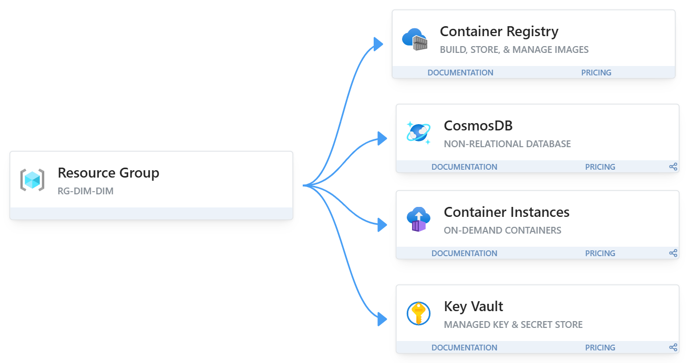

# $DEVOPS-CLOUD-CP04$

Implementar a migração completa para ACR e ACI

## **Objetivo**

Atualizar a arquitetura de forma eficiente, com auxilio do docker compose para automatizar e orquestrar a criação de containers.

## 1. **Projeto e arquitetura**

O Shopping enfrentava dificuldades em analisar dados de vendas e clientes. A DimDim propôs uma solução de IA Generativa para potencializar decisões, reduzindo custos e aumentando eficiência.

Segundo passo foi criar um ambiente DEV em cloud para:

- Armazenar dados: CosmosDB, banco de dados NoSQL
- Manipular os registros: API Python
- Processamento NLP: Ollama, permite rodar LLMs de ponta sem precisar de acesso à internet ou de serviços em nuvem
  > imagem oficial ollama/ollama

### _Atual - PAAS_

Será feito o uso de PAAS, onde teremos em nosso grupo de recursos:

1. CosmosDB: Banco de dados NoSQL, que substitui o mongoDB | persistência de dados
2. Azure Container Registre `ACR`: Armazena nossas imagens personalizadas | ontrole de versionamento e segurança de imagens
3. Azure Container Instance `ACI`: Responsável por rodar nossa aplicação python e o ollama
4. Key Vault: Guarda todas as senhas de forma semelhante a variáveis de ambiente, usamos para acessar o banco ou instanciar o container | proteção de credenciais

> mais abstração, menos manutenção, mais agilidade.



#### _Dependências_

- API -> depende do CosmosDB e do Ollama
- Ollama -> depende de imagem + modelo LLM
- API/CosmosDB -> credenciais vindas do Key Vault

### _Futura_

> provavelmente SAAS

---

## 2. Implementação ACI

### Serviços necessários

- datalk-api: aplicação FastAPI [Dockerfile](./api/Dockerfile)
- ollama: processamento de LLM (imagem oficial ollama/ollama)
- cosmosDB: banco NoSQL gerenciado (substitui MongoDB local)

### Configuração de redes para comunicação entre os containers

No ACI, os containers dentro do mesmo containerGroup compartilham a mesma rede interna, permitindo que a API acesse ollama:11434 e cosmosdb-endpoint:27017

### Gerenciamento de volumes

Volumes nomeados:

```yaml
volumes:
  - name: ollama-data
    emptyDir: {}
```

#### Mapeamentos:

- datalk_ollama:/root/.ollama → persistência de modelos Ollama

### Variáveis de ambiente para a configurações

#### Conexão com o cosmosDB

```yaml
- name: MONGO_URI
  secureValue: "https://kv-mini-lab-367.vault.azure.net/secrets/MONGO-CONN" # substituir
```

#### Conexão ACR

```yaml
imageRegistryCredentials:
  - server: acrminilab367.azurecr.io
    username: $REGISTRY_USERNAME # substituir
    password: $REGISTRY_PASSWORD # substituir
```

### Políticas de restart

Usamos `Always` no ACI, não tem `unless-stopped`.

### Exposição das portas necessárias

- ollama -> 11434
- python -> 8000

### Health checks para monitoramento dos serviços críticos

Health checks assegura que os serviços estão rodando de forma funcional

```yaml
livenessProbe:
  httpGet:
    path: /docs
    port: 8000
  periodSeconds: 30
  failureThreshold: 3
readinessProbe:
  httpGet:
    path: /docs
    port: 8000
  periodSeconds: 10
  failureThreshold: 3
```

### Utilizar usuário sem privilégios administrativos para executar o App

No CosmosDB, podemos criar um usuário com permissões restritas apenas à database necessária (ex: datalk), e usar essa credencial no Key Vault em vez da credencial administrativa.

## 3. Deploy

### Clone do repositório

```bash
git clone https://github.com/Entrega-CheckPoint/DEVOPS-CLOUD-CP04

cd DEVOPS-CLOUD-CP04
```

#### Passo 1 — Login no ACR

```bash
az acr login --name acrminilab367
```

#### Passo 2 — Build da imagem

Na pasta onde está teu `Dockerfile`, roda:

```bash
docker build -t datalk-api:v1 .
```

#### Passo 3 — Tag para o ACR

Agora precisamos taguear a imagem local com o endereço do ACR:

```bash
docker tag datalk-api:v1 acrminilab367.azurecr.io/datalk-api:v1
```

#### Passo 4 — Push para o ACR

Envia pro repositório do ACR:

```bash
docker push acrminilab367.azurecr.io/datalk-api:v1
```

#### Passo 5 — Conferir no ACR

Pra confirmar que subiu:

```bash
az acr repository list --name acrminilab367 --output table
```

### Subir o container

```bash
az container create \
  --resource-group $RG_MINI_LAB \
  --file aci-deploy.yaml
```

### Conferir a aplicação

[http://datalk-api.eastus.azurecontainer.io:8000/docs#/](http://datalk-api.eastus.azurecontainer.io:8000/docs#/)

### Troubleshooting básico

- API não sobe:
  Verifique os logs:

  ```bash
  az container logs --resource-group rg-mini-lab --name datalk-group --container-name datalk-api
  ```

- Erro de conexão com MongoDB:
  Confirme se a string de conexão no Key Vault está correta e se o ACI tem permissão de acesso.

- Ollama não responde:
  Confirme se o modelo foi baixado (docker exec -it ollama ollama list)
  az container logs --resource-group rg-mini-lab --name datalk-group --container-name ollama

## Link do video

[CP04 - Video](https://www.youtube.com/watch?v=mSqR44Tojyk)
